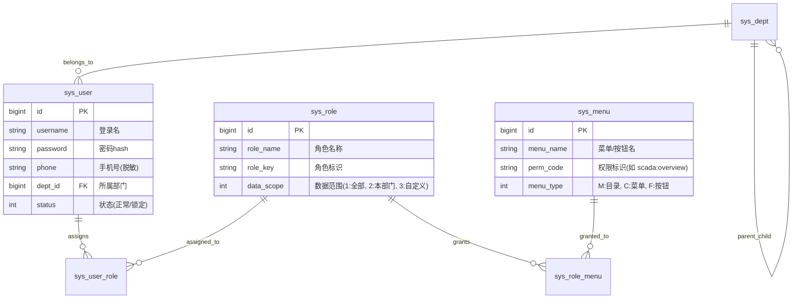
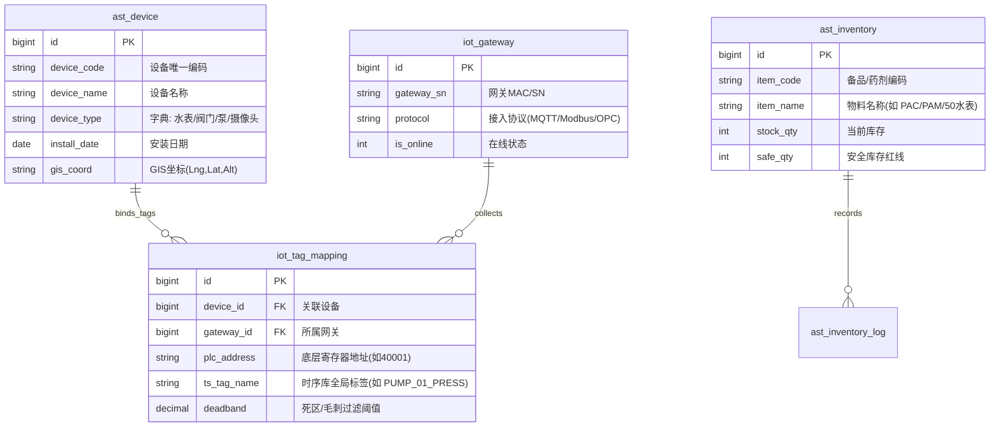
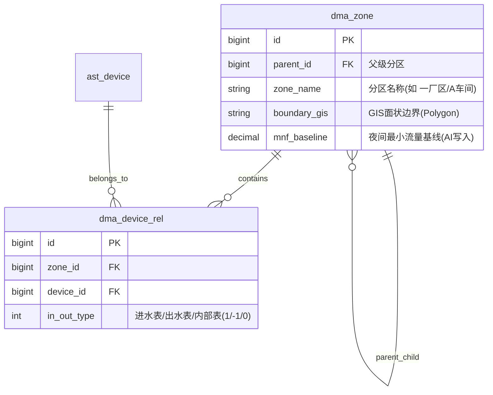
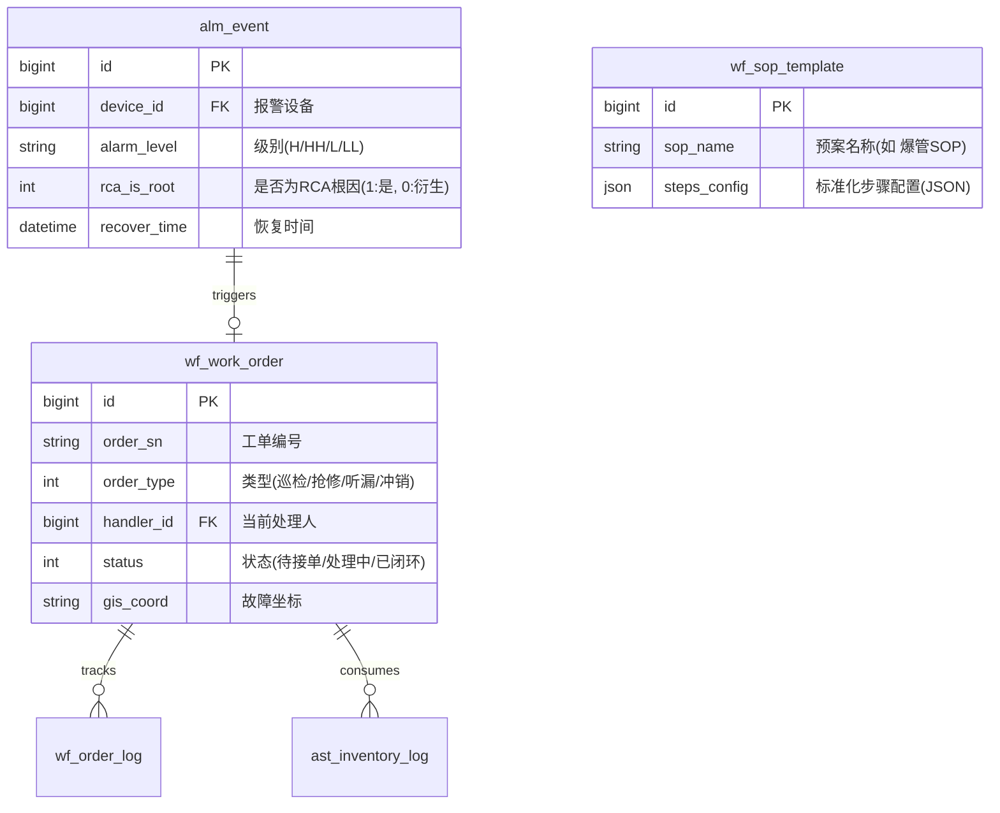
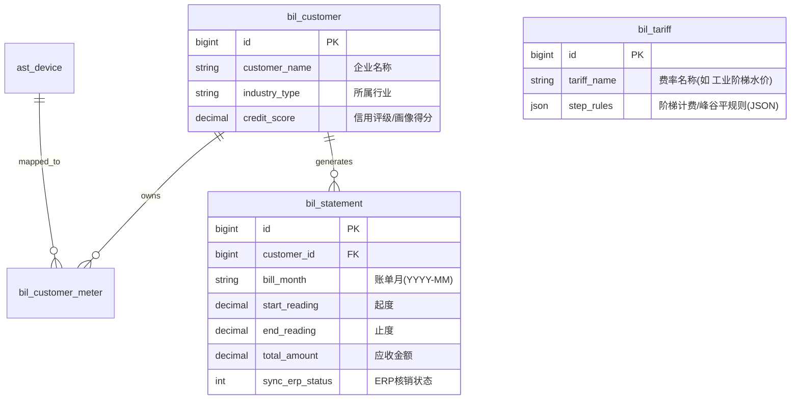

# 信创工业综合治理平台 - 数据库表结构设计规范 (Database Schema Design)

本文档基于《需求文档(PRD)》与《前端菜单与页面功能设计规范》，定义系统底层的数据存储模型。

## 1. 数据库选型与架构分离原则

为支撑“百亿级高并发时序数据”与“复杂业务逻辑”的并行处理，系统采用**冷热分离、结构异构**的双数据库底座架构：
1. **关系型业务数据库 (PostgreSQL 14+)**：存储台账、组织架构、RBAC权限、工单、组态元数据及设备标签映射关系（即所有的静态/低频更新数据）。
2. **时序数据库 (TDengine 3.x / IoTDB)**：专职存储水务、电力、环境等传感器的秒级/毫秒级历史时序数据（动态数据），并利用其流计算引擎进行降采样聚合。

---

## 2. 核心业务域 ER 图设计 (基于 PostgreSQL)

### 2.1 系统权限与组织架构 (RBAC & Org)

采用标准的 RBAC 模型，并引入“数据范围（Data Scope）”字段进行细粒度隔离。



### 2.2 资产、设备与物联网网关元数据 (Assets & IoT)

打通“实物资产”、“接入网关”与“时序标签（Tag）”的映射关系。



### 2.3 拓扑、DMA分区与水力模型 (Topology & DMA)

处理空间拓扑的层级嵌套与设备的挂载关系。



### 2.4 工单与应急协同 (Workflow & SOP)



### 2.5 营收对账与企业大户 (Billing & Key Accounts)

系统不碰资金流，但需存储计费规则与对账单，并映射到物理水表。



---

## 3. 时序数据库设计 (基于 TDengine)

针对高频监控数据（如压力、流量、电表读数），在 TDengine 中采用 **“超级表 (Super Table) + 子表 (Sub Table)”** 模型。

### 3.1 超级表定义 (Super Table)
所有相同物理属性的传感器共用一张超级表，便于做全网维度的聚合查询。

**超级表: `st_telemetry` (通用遥测超级表)**

| 字段名 (Field) | 类型 (Type) | 说明 (Description) |
|---|---|---|
| `ts` | TIMESTAMP | 数据时间戳 (主键) |
| `val` | DOUBLE | 采集值 |
| `status` | INT | 数据质量标识 (0:正常, 1:死值拦截, 2:超限剔除, 3:AI补偿插值) |

**标签 (Tags - 用于高效过滤与聚合)**
| 标签名 (Tag) | 类型 (Type) | 说明 (Description) |
|---|---|---|
| `device_code` | NCHAR(64) | 关联 PostgreSQL 中的设备编码 |
| `tag_name` | NCHAR(64) | 测点标签 (如 `PUMP_01_PRESS`) |
| `metric_type` | NCHAR(32) | 指标类型 (如 `pressure`, `flow`, `energy`) |
| `dma_id` | BIGINT | 所属 DMA 分区 ID (用于快速流计算某分区的总供水量) |

### 3.2 子表自动建表策略
当边缘网关（MQTT）首次上报一个新的 `tag_name` 时，应用程序（如 NestJS）自动调用 SQL 在 TDengine 中建立子表。
*子表命名规范*：`t_{device_code}_{metric_type}` (例如：`t_meter001_flow`)。

### 3.3 流计算降采样 (Continuous Query)
在 TDengine 内部建立连续查询（CQ），自动生成 5分钟、1小时、1天的聚合数据表，大幅降低前端趋势图查询的延迟。
```sql
-- 示例：自动计算每小时的用水量（按DMA分区聚合）
CREATE TABLE cq_dma_hourly_flow AS 
SELECT sum(val) AS total_flow 
FROM st_telemetry 
WHERE metric_type = 'flow' 
INTERVAL(1h) 
PARTITION BY dma_id;
```

---

## 4. 核心安全与审计策略
1. **密码存储**：`sys_user.password` 强制采用 `Bcrypt` 加密，加盐 (Salt) 处理。
2. **脱敏存储**：敏感个人信息（如大户法人手机号）采用 AES-256 对称加密存入数据库，仅在前端拥有 `sys:audit:view_mask` 权限时才通过 API 解密传输明文。
3. **全局审计**：建立 `sys_audit_log` 表，记录 `req_url`, `req_method`, `user_id`, `ip_address`, `before_data_json`, `after_data_json`，任何针对核心业务表（如配方、费率、联锁规则）的 UPDATE/DELETE 操作，触发器（Trigger）或后端 AOP 将自动保存 JSON Diff 以供追溯。