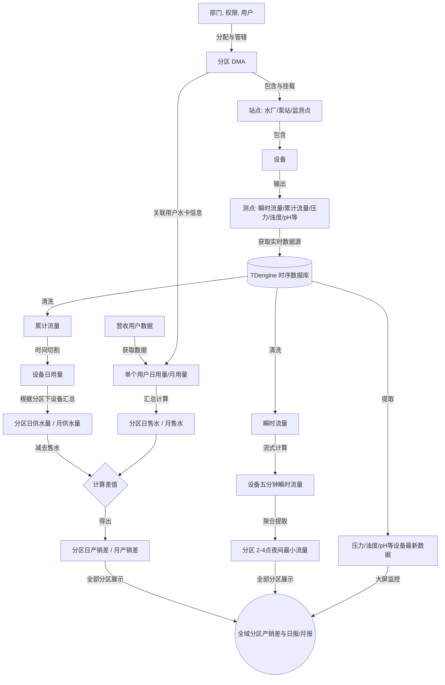

# 信创工业综合治理平台 - 需求文档 (PRD)

## 1. 总体目标
构建一个符合国家信创标准的工业级综合治理平台。平台整合水务、电力、能耗、环境品质、安防门禁、资产运维、房屋、天气、地理、AI等多维数据，提供百亿级时序数据的处理与多级清洗聚合能力，在边缘计算、物联网（IoT）、毫秒级设备反控及全场景AI主动预测（以水务为核心）方面提供卓越体验。同时，系统底层需具备完备的安全性与商业权益保护（防欠款）机制。

## 2. 核心工业数据流转与平台治理全景 (Core Business Flow)

本平台的核心业务价值在于打通从底层物理资产到上层商业结算的数据链路，实现“供-销-差”的精准量化。以下是系统主要的数据流转全景：

### 2.1 基础台账与元数据构建 (Foundational Data)
系统运行的第一步是建立严密的物理与逻辑映射关系，需依次补充以下基础信息：
- **组织与权限**：补充部门、权限、用户。
- **空间与逻辑拓扑**：补充分区 (DMA)。
- **营收映射**：补充用户水卡信息（建立物理分区与商业收费的纽带）。
- **物理资产树**：
  - **站点**：补充水厂、加压泵站、二供泵房、管网监测点。
  - **设备**：补充挂载在每个站点下的具体设备列表（如水泵、流量计）。
  - **测点**：补充每个设备输出的数据类型（如瞬时流量、累计流量、压力、浊度、pH 等）。

### 2.2 实时数据采集与时序底座 (Data Acquisition)
- **数据抓取**：对接实时数据数据源，定时抓取底层传感数据并统一存放入时序数据库 TDengine (tgen) 中，作为后续所有计算的唯一事实来源。

### 2.3 时序数据清洗与供水量计算 (Supply Data Processing)
在 TDengine 中对原始数据进行清洗与流式聚合：
- **瞬时流量流转**：原始瞬时流量 ➔ 数据清洗 ➔ 计算得出 **设备 5 分钟瞬时流量** ➔ 进一步计算提取得出 **2:00-4:00 间的分区夜间最小流量 (MNF)**。
- **累计流量流转**：原始累计流量 ➔ 数据清洗 ➔ 切割出 **设备日用量** ➔ 根据分区下的设备列表汇总计算 ➔ 得出 **分区日供水量** 与 **分区月供水量**。
- **状态数据流转**：实时获取设备的最新状态数据（如压力、浊度、pH 等），用于前端 SCADA 与大屏的实时监控展示。

### 2.4 营收侧数据流转与售水量计算 (Revenue Data Processing)
- **用户用水量计算**：接入营收用户数据来源，根据营收数据类型（日用、月用或累计），计算出单个用户的 **日用水量** 和 **月用水量**。
- **分区售水汇总**：根据分区下关联的用户水卡信息，将单个用户的用量进行空间汇总，计算出 **分区日售水** 和 **分区月售水**。

### 2.5 产销差计算与全域展现 (NRW & Global Display)
- **产销差 (NRW) 计算**：通过 `分区日/月供水 - 分区日/月售水`，计算出 **分区日产销差** 和 **分区月产销差**。
- **全域数据展示原则**：系统必须打破仅展示个别分区的“面子工程”，必须提供涵盖 **所有分区** 的日报、月报、产销差展示看板以及夜间最小流量监控台。只有实现全量分区的透明化管理，才能真正体现系统的漏损治理与调度优化作用。

---

## 3. 核心功能模块需求

### 3.1 综合业务监控与管理
- **水务（重中之重）与 DMA (独立计量区域) 漏损管理**：
  - **全域 GIS 管网空间映射与水力拓扑**：导入城市级/厂区级水管网 GIS Shapefile 矢量数据，将地下给排水管线、水厂、二供泵房、加压泵站等设施进行空间落图与拓扑连通性关联。
  - **GIS 地图动态交互与报警联动**：在地图上直观悬浮显示每个压力点、流量点的实时数值与流向。利用管线颜色渐变呈现流速/压力分布。若出现压力骤降或流速激增异常，对应管段与测点在地图上立即高亮闪烁，并联动右侧面板快速展示报警详情与现场视频，实现“一图统管”。
  - **多级 DMA 分区与产销差 (NRW) 实时结算**：支持从厂区级到车间级、楼层级的一、二、三级 DMA 网格化虚拟切分。系统基于国际水协 (IWA) 标准水量平衡表，实时计算供水量、售水量、表观漏损与真实漏损。
  - **多维产销差与水量统计报表（全域覆盖）**：提供强大的报表引擎，支持以全局视角一键生成并查看**所有分区**的供水量、售水量、产销差及漏损率，生成完整的日报、月报。拒绝仅展示个别分区的局部看板。支持报表数据的**上下级穿透下钻**（点击父分区展开子分区明细），并支持任意数据维度的前后月份（环比）、历史同期（同比）叠加曲线比对，直观暴露异常用水波动。
  - **夜间最小流量 (MNF) 智能暗漏排查（全域监控）**：在每日凌晨（如 2:00-4:00）用户用水低谷期，系统基于底层 TDengine 自动提取并展示**所有 DMA 分区**的最小流量基线。结合 AI 剔除合法夜间生产用水后，精准量化全区域各节点的“背景暗漏水量”。一旦某分区的 MNF 连续 3 天偏离动态基线，自动向外勤派发“听漏探漏”工单。
  - **基于水力模型的“声水”交叉精准定位**：系统深度融合微观管网水力模型（如 EPANET 算法）与声学物联网设备（智能听漏仪/相关仪）。当水动力学（流量突增/压力骤降）出现异常时，系统自动调取该区域的声学频段数据进行空间交叉比对，实现物理漏水点的 **米级精准定位**。
  - **主动压力调控减漏 (PRV 联动)**：针对地形高差大或夜间压力冗余的管网区域，系统根据实时流量与末端压力反馈，**自动毫秒级反控管网中的智能减压阀 (PRV)**。在用水低谷期主动降低管网运行压力，从物理源头上减少漏水量并极大地降低爆管概率。
  - **用量分析与预测**：支持按日、周、月维度生成用水报表，并结合历史同环比、节假日及天气因素，利用时序预测算法（如ARIMA、LSTM等）对未来用水量进行预测。
  - **大用户监控与“表观漏损”挽回**：针对高耗水特种设备或工业用水大户建立独立监控档案。AI 智能比对水表口径与实际流量曲线，精准识别“大表小用”（导致始动流量不计费）或水表倒转、违规偷水行为，推送水表降级/升级建议，挽回水费流失。
  - **爆管预警与 GIS 爆管关阀寻址**：一旦AI模型输出爆管高风险预警（置信度>85%），系统自动截取前后30分钟压力、流量曲线，并在10秒内生成带GIS坐标的紧急工单。**（GIS亮点功能）** 系统基于管网连通性拓扑分析，自动计算并高亮显示**需要关闭的最近 N 个上游/下游控制阀门（停水影响分析）**，并将阀门列表推送至抢修人员及周边受影响的用户（车间/居民）。
- **电力与能耗**：工业级能耗分析，多级计量单元的实时监测。
  - **异常用电诊断与“窃电/漏电”识别**：建立车间级电量平衡模型（总表与分表比对）。当线损率突增或非生产时段（如夜间、节假日）出现异常用电基线偏移时，系统自动识别潜在的“设备空转”、“漏电”或“违规用电”行为，并推送节能整改工单。
  - **峰谷平电价需量优化**：结合当地电网的分时电价政策与历史负荷数据，AI 推荐最优的生产设备排班计划（如将高耗能设备自动调度至谷电时段运行），实现智能降本。
- **空间与环境品质管理**：深度监测室内/密闭工业场景的湿度、PM2.5、CO2浓度及特定有害气体。
  - **受限空间“窒息/中毒”主动干预**：针对地下管廊、密闭储罐等高危空间，若有害气体（如硫化氢、一氧化碳）浓度逼近安全阈值下限，且门禁系统检测到内部有人，系统将**自动联动开启大功率排风新风系统**，并锁死进入门禁，触发声光报警与人员撤离广播。
- **安防与门禁监控**：整合AI视频监控、门禁刷卡记录及消防火灾报警数据。
  - **全景安防数字沙盘 (BIM/GIS融合)**：将视频流投射或挂载到 3D 建筑模型的墙面/空间内（Video-in-3D），实现“所见即所得”的空间安防巡检；在警情发生时，摄像机视锥体自动变红，直观展示盲区。
  - **AI 视觉越界与“一人一卡”防尾随**：利用边缘 AI 摄像头识别关键设备区（如高压配电房、水泵核心区）的异常闯入。联动门禁数据，若刷卡记录为 1 人，但 AI 视觉识别进入 >1 人，立即触发“尾随报警”并截取现场 15 秒视频推送安保中心。
  - **火情初期秒级联动封控**：接收到烟感/温感报警后，系统自动调用最近的摄像头对准起火点进行二次视觉确认；确认后，联动切断非消防电源、打开消防通道门禁、启动排烟，并向对应楼层发布疏散指令。
- **房屋与地理**：BIM/GIS融合，实现资产与地理空间信息的三维可视化管理。
  - **基于 BIM 的“盲穿”地下管线透视与安全间距分析**：在发生如“地面塌陷”、“施工挖掘”等事件前，通过移动端 AR 技术或 PC 端 BIM 剖视，精准透视地下暗埋的水、电、气管网走向，防止二次施工造成的管线挖断事故。提供“安全间距分析”，若施工动土范围与高压电缆、燃气管线空间距离 <1 米，直接锁定施工审批。
- **天气**：气象数据接入，为预警和生产调度提供环境支撑。
  - **极端气象“防汛/防冻”前置调度**：对接气象局数据，当预测到未来 24 小时内有暴雨或台风时，系统自动生成“防汛排涝预案”（如提前抽空雨水调蓄池、检查排水泵状态）；若预测有极端寒潮，提前触发“防冻保温工单”（如裸露水管伴热带巡检）。

### 3.2 运维治理与协同闭环 (执行层)
- **报警收敛与根因分析（RCA）**：建立工业级的“报警风暴压制”机制。基于设备与管网的拓扑关系，在短时间内发生大面积连锁报警（如主管道爆管导致下游全面水压报警）时，自动进行报警合并与收敛。
  - **算法应用逻辑**：通过图数据库（或PG的递归查询）维护管网拓扑树，当同一拓扑树下3分钟内触发>5个相关报警时，自动收敛为1个“父级综合报警”，并通过根因分析算法提取出上游核心故障点，避免无效工单轰炸。
- **设备资产全生命周期台账**：建立设备静态与动态资产档案（如采购批次、过保时间、历史维修记录、备品备件库存等）。
- **备品备件与仓储精细化管理（新增）**：
  - **安全库存与智能补货预警**：建立耗材与备件（如各类口径的阀门、水表、PAC/PAM药剂）的动态库存台账。当低于安全库存红线时，系统自动触发采购建议工单。
  - **“工单-物料”强绑定闭环**：现场抢修人员接单后，可通过移动端直接在仓库扫码（二维码/RFID）领料。物料出库数量自动与对应抢修工单绑定，实现维修成本的精准核算与物料防流失追踪。
- **人员与资产定位**：结合室内外定位技术（如UWB、蓝牙或GIS）与门禁轨迹，实现人员、特种车辆及移动高价值资产的实时位置追踪。
- **巡检与工单流转系统**：
  - **智能巡检**：支持制定周期性或基于AI预测触发的动态巡检计划，支持移动端扫码/NFC打卡执行。
  - **工单流转**：将“时序预警”、“AI预测”与“巡检异常”转化为标准工单，实现**预测性维护的自动化派单闭环**（创建-接单-执行-验收-评价）。
  - **SLA超时升级机制**：对工单的各个环节（如接单超时、处理超时）设置SLA阈值，超时自动升级并抄送至上级管理者。
- **统一消息与通知引擎**：构建多渠道（短信、邮件、App推送、企微/钉钉等）告警与通知机制。在水务爆管等紧急事件发生时，结合“人员定位”，将紧急工单与通知秒级推送给距离最近的可调度人员。

### 3.3 数据中台与治理（百亿级数据架构）
- **海量时序与多源异构接入**：支持时序数据高并发接入；针对**设备、站点、测点、分区**等模型提供全渠道数据接入（支持 MQ、Kafka、HTTP、文件导入）。
- **数据质量与离线补偿**：
  - **短期断点（插值规则）**：网络波动等短期缺失（<3小时），自动使用线性插值或前值填充，并标记插值标签（如`is_interpolated=true`）。
  - **离线判定**：中断**超过 1 天**时判定为“离线故障”，停止插值并抛出异常工单。
- **数据清洗与流式聚合**：依托独立时序数据库（如 TDengine 等）自带流计算引擎，将海量原始数据**标准化聚合为 1分钟、5分钟、1小时**等多时间维度。支持对流量、温度、压力等配置不同聚合函数（`sum`/`avg`/`max`）。
- **复杂离散累积量推算（重点业务场景）**：针对电池供电、低频非连续上报的远传水表：
  1. **整点基准重构**：利用单调三次样条插值（PCHIP）强制推算各整点虚拟累积量。
  2. **时/日用量还原**：通过相邻整点差值，精准还原“每小时用量”与“每日供水量”。
  3. **虚拟瞬时流速**：上报间隔极长时，基于历史日用水变化曲线（Diurnal Curve）加权分配总水量，模拟贴近物理规律的瞬时流速。
- **异构设备异常容错**：
  - **表计翻转补偿**：达到最大量程归零时，自动识别巨大负差值并加上量程接续。
  - **负压倒转与跳变剔除**：强制单调递增约束过滤负向回退；通过变化率校验剔除超物理流速极限的脏数据。
- **售水营收数据融合清洗**：定时通过 API 接入按月/双月出账的非连续营收数据，通过清洗与折算（平滑分摊到每日/小时）实现与实时供水时间维度的对齐。
- **分级存储与无缝查询**：针对百亿级历史数据实现冷热分离（热数据在SSD，冷数据归档至HDD/MinIO），且查询接口对应用层完全透明。

### 3.4 权限管控与系统安全
- **多维组织架构与数据权限 (RBAC+)**：
  - 支持集团、厂区、车间多级划分，数据权限严格与组织层级及分区挂钩（支持“本人”、“本部门及下级”、“特定 DMA 可见”等行级隔离）。
- **细粒度功能与界面拦截**：
  - 从页面菜单、操作按钮（导出、修改阈值）到可视化面板均可通过角色灵活配置。所有后端 API 调用强制校验 Token 与操作权限。
- **安全审计与数据脱敏**：核心反控指令与阈值修改记录详尽审计日志；手机号及敏感资产在前端自动星号掩码脱敏。

### 3.5 工业级 SCADA 深度融合与控制中枢
系统向下兼容并替代部分传统 SCADA，成为工业现场控制中枢。
- **协议采集与底层网关在线配置（新增）**：
  - 直接读取西门子、施耐德等主流 PLC/DCS（支持 OPC UA、Modbus RTU/TCP、Profinet 等）。
  - **云端向下发发规约**：提供从云端向边缘智能网关（如工业树莓派）批量下发串口配置（波特率、校验位）、Modbus 寄存器地址表的功能。
  - **断点续传与本地缓存**：网关在断网期间自动将数据压入本地 SQLite 或缓存列队；网络恢复后，严格按照时序自动向云端进行“断点续传（Data Backfill）”，保证云端历史数据 0 丢失。
- **Web 组态与动态交互**：内置拖拽式 2D/2.5D 工业图元库，实现零代码工艺组态；图元状态与时序数据深度绑定（流速动画、变频变色）。
- **安全联锁 (Interlock)**：支持多维度分级报警；在 SCADA 软件层配置因果矩阵，关键参数越限时毫秒级自动触发联锁保护（如强制关泵），防范事故。
- **配方管理 (Recipe Management)**：支持多版本生产配方（目标流量、加药比例）的审核与一键下发，记录电子签名防篡改。

### 3.6 专业水力模型在线仿真与数字孪生（新增）
系统突破了只做“事后统计”的局限，引入基于管网物理拓扑和流体力学的计算引擎。
- **微观水力模型 (EPANET) 无缝集成**：支持导入 `.inp` 格式的微观管网模型。将实时 SCADA 数据（水厂出水压力、边界流量）作为边界条件实时注入水力模型。
- **在线平差计算与全网流场推演**：针对管网上未安装传感器的“监控盲区”，模型通过在线平差算法（Hydraulic Balancing），每 15 分钟自动计算出全网每一个节点（Node）的压力和每一段管道（Pipe）的流速/流向。
- **“What-If”沙盘推演与改建评估**：调度员在前端界面上可以建立虚拟场景。例如：“如果明天关闭阀门 V-05，并把 1 号泵频率调高至 45Hz”，系统将在 1 分钟内通过模型推演并给出报告：哪些区域会水压不足，管网整体能耗会上升多少。这为调度决策提供了精准的量化支撑。

### 3.7 AI 综合赋能与大模型调度 (AIGC)
- **核心AI与预测维护**：涵盖水务爆管高精度预测（基于管网压力、流速等）、能耗趋势分析及工业视频监控视觉分析。
- **大模型问答与操作助理**：接入国产大模型，投喂工单与专家库，实现自然语言异常查询与维修建议生成。
- **智能应急调度**：面对严重爆管等紧急态势，大模型基于资源分布与气象数据，自动生成多套应急抢修预案供决策。

### 3.8 营收与计费对账系统（重度关联模块新增）
在坚持“不直接触碰资金池”底线的前提下，系统必须为财务与营收部门提供强有力的数据核算与对账依据。
- **水价/电价阶梯费率库配置**：建立包含基础费率、多级阶梯费率（如按年度累积用量阶梯）、污水处理费代收、峰谷平分时电价的复合费率库。
- **大用户/集团合同台账管理**：针对重点工商业大户，支持录入供水合同（保底水量、约定水压、阶梯优惠策略）。
- **出账、对账与呆坏账核销**：
  - **自动出账结算**：结合智能远传水表，每月（或自定义计费周期）自动按“抄表日读数差值 × 对应费率库”生成电子对账单。
  - **用量稽查与“跑冒滴漏”追缴**：基于数据中台分析出的“表倒转”、“长期微小流量（始动流量下不计费）”，系统自动输出“待稽核水量”，辅助营收部门发起专项追缴，挽回经济损失。

### 3.9 真实业务边缘场景 (Edge Cases) 容错与闭环机制
针对水务及工业现场极端复杂的现实脏数据，提供以下兜底能力：
- **抄表错期分摊与对齐**：通过算法将跨月/双月账单水量，按天数或供水趋势权重动态摊销至自然日/月，避免产销差“假漏损”。
- **估抄与追溯重算**：当营收系统产生“估抄水量”并在未来获取真实读数后，系统支持一键触发历史产销差追溯重算（Recalculation）。
- **合法未计费豁免冲销**：建立“冲销工单”，将市政消防、绿化取水等有水无钱部分从“真实漏损”中合法剥离。
- **时空拓扑时间切片**：引入动态拓扑时间轴，查询历史漏损时严格挂载对应日期的物理拓扑快照。
- **换表拆表数据连续性**：强关联换表工单，底层算法自动执行 `(老表拆除止码 - 上期读数) + (新表当前读数 - 新表安装起码)` 接续，杜绝负流量断层。

### 3.10 系统边界与商业权益保护
- 平台聚焦用量统计与分析态势展示，**坚决不直接接入支付结算网关（如支付宝/微信直连扣款）**，只提供出账数据凭证，由专业财务系统完成最终核销，规避金融合规风险。
- 采用动态 License 授权码防欠款策略，应用层拦截提示，但不影响底层主干计算与采集正常运行。

## 4. 系统架构与技术选型规划

### 4.1 前后端架构设计
- **前端架构与可视化大屏**：
  - **单体大前端底座**：采用 **Vue3/React + TypeScript**，结合微前端设计思路，将管理后台与监控面板融合在统一的大底座中，保证权限体系一致性。
  - **可折叠 2D 拓扑全景图（革新树形结构）**：摒弃传统的左侧层叠树结构管理方式。针对站点、设备、DMA分区等层级，提供基于 2D 平面的全景逻辑拓扑组件。用户可通过鼠标滚轮缩放画布、点击父节点“折叠/展开”其下辖子站点或设备，以“网络拓扑/思维导图”的直观形态展现错综复杂的从属与水力流向关系。
  - **数字孪生与大屏监控（重点）**：利用 WebGL/Three.js 或国产数字孪生引擎（如 ThingJS 等）构建厂区级三维大屏，实现 BIM 模型导入、设备状态的三维挂载与实时动画反馈。
  - **高性能流式渲染**：针对大屏上万级别设备测点的数据高频推送（如 WebSocket 毫秒级刷新），前端引入 `requestAnimationFrame` 机制和 Canvas 离屏渲染，保障浏览器帧率（FPS）稳定，避免大屏卡顿卡死。
  - **动态组态与可视化编排**：内置零代码/低代码的可视化组态工具，允许业务人员通过拖拽图表组件、管道元件，自定义各个车间或工艺流程的 2D/2.5D 监控面板。
- **后端架构**：采用基于 **NestJS** 框架的分布式微服务架构。
  - **服务拆分原则**：按大业务领域进行粗粒度拆分，如“报警中心服务”、“数据中台服务”、“设备接入网关服务”、“业务调度服务”等。
  - **部署与扩容**：各个微服务完全解耦，支持根据业务负载进行**独立的服务器部署与横向扩容**（例如，在数据洪峰时单独为“数据中台服务”增加服务器）。
  - **服务治理**：利用 **Redis** 作为核心的服务注册中心与状态监控中枢。
  - **高可用与自愈**：各微服务通过 Redis 维持心跳，当监控到服务超时或无响应时，触发自动重启/熔断机制，保障系统在复杂工业环境下的极高可用性。

### 4.2 信创适配要求
- **底层硬件**：暂无特定厂商要求，保持通用性与可扩展性。
- **操作系统**：以 **麒麟操作系统（Kylin）** 为主。
- **数据库（解耦设计）**：
  - **基础业务库**：采用 **PostgreSQL (PG)** 存储设备台账、组织架构、业务配置等关系型基础数据，方便后续向其他纯信创关系库平滑移植。
  - **时序与大数据库**：采用 **独立的时序数据库（如 TDengine / IoTDB 等）** 专职处理百亿级高频时序监控数据，并充分利用其内置流计算能力进行降采样与清洗聚合。
- **缓存与中间件**：
  - **Redis**：不仅用于业务缓存，更作为后端微服务的心跳监控与服务注册中枢。
  - 按需引入其他主流信创组件。

## 5. 前端应用功能清单与视图规划

为确保系统的可落地性与交互一致性，前端将基于“单体大前端”架构，提供以下核心功能模块与视图：

### 5.0 工业数据流转与平台治理全景图（系统全局常驻入口）
- **右上角常驻全景图入口**：在系统主界面右上角（全局 Navbar）提供一个“工业数据流转与平台治理全景图”按钮。
- **功能描述**：点击后通过右侧抽屉（Drawer）展示系统的业务主干脉络。以步骤节点的形式，展示从“基础台账构建 -> 时序数据采集与清洗 -> 供水量与夜间流量提取 -> 营收侧售水量融合 -> 全域产销差计算与展现”的完整链路。这是整个系统的业务骨干大纲，帮助用户及运维人员随时掌控平台的数据流向与计算逻辑。

### 5.1 沉浸式 GIS/BIM 融合监控大屏（首屏展示）
- **动态地图底座与切换**：大屏及监控界面以地图为全屏背景板（沉浸式）。支持地图引擎的动态配置，可无缝切换公网地图（高德、百度、天地图）或内网自建离线地图（GeoServer/ArcGIS）。
- **矢量数据(Shapefile/GeoJSON)空间挂载**：支持地下管线、阀门、泵站、消防栓等 GIS 矢量数据的动态导入与渲染。管线依据流速/压力实时呈现动态水流颜色渐变。
- **一图统管与联动交互**：在地图上直观悬浮显示核心设备的实时指标（压力、流量、能耗）。当发生爆管或越限报警时，地图视角自动平移并缩放（Zoom-in）至报警点，该测点高亮闪烁，并联动弹出右侧抽屉展示现场监控视频与反控面板。

### 5.2 综合业务监控面板
- **全局态势感知 (Dashboard)**：通过可视化图表直观展示全厂/全区的核心 KPI（如今日总供水、总售水、整体产销差率、总能耗折标煤、当前告警数）。
- **可折叠 2D 拓扑全景图**：摒弃传统的左侧层叠树结构。提供基于 2D 平面的全景逻辑拓扑画布，用户可通过鼠标滚轮缩放，点击父节点动态“折叠/展开”下属设备及 DMA 分区，直观展现水力流向与工艺从属关系。
- **工业 SCADA 组态看板**：为车间、泵房等微观场景提供 2D/2.5D 的工艺流程监控画面（支持动态图元，如液位升降、电机旋转动画），并提供具备鉴权与写前校验的远程反控按钮（启停、PID调节）。

### 5.3 多维统计与报表中心
- **分区日报/月报/年报**：针对 DMA 分区、车间或能耗单元，自动生成标准化的日、月、年结算报表（包含供水量、售水量、夜间最小流量 MNF、产销差率、吨水能耗等）。
- **报表穿透下钻与多维比对**：支持在报表表格中点击“父级分区”，直接下钻展开子分区的明细数据。支持任意数据指标的环比（前后月）、同比（历史同期）叠加曲线比对分析。
- **营收与抄表数据导入/清洗管理**：提供营收数据的 API 对接监控面板及 Excel 批量导入入口，支持手动触发“错期分摊折算”与“估抄重算”任务，并展示数据清洗前后的对比日志。

### 5.4 运维与工单闭环管理
- **报警风暴与 RCA 根因看板**：展示经过算法收敛后的“有效报警事件”及提取的根因节点。支持历史报警趋势与频发故障设备的 Pareto（二八定律）分析图。
- **工单全生命周期管理**：涵盖“AI预测预警”、“巡检异常”、“报警转化”等触发的工单池。支持工单的派发、接单、执行录入（含照片上传）、验收与 SLA 超时升级监控。
- **未计费水量豁免/冲销审批**：针对消防取水、管网冲洗等情况，提供合法的取水量提报与审核页面，确保产销差结算的精准性。

### 5.5 设备与资产台账管理
- **设备全生命周期档案**：管理水表、流量计、泵阀、边缘网关等硬件的静态属性（型号、口径、量程、采购日期、保修期）及动态台账（历史维修记录、累计运行时间）。
- **异构设备参数与换表接续**：针对水表等计量设备，提供“换表/拆表”业务录入界面（记录老表止码、新表起码），自动触发底层清洗引擎的累积量接续补偿算法。支持设备上报类型（累积量/瞬时量）的换算规则配置。

### 5.6 系统设置与权限管控 (RBAC+)
- **多维组织架构管理**：支持集团、厂区、车间（或一、二、三级 DMA 分区）的层级树维护。
- **用户与角色权限分配**：
  - **功能与菜单权限**：控制左侧菜单栏、页面标签页，精确到特定操作按钮（如“导出报表”、“强制关阀”）的显示与隐藏。
  - **数据范围隔离**：为特定角色绑定“仅本人”、“本部门及下级”、“特定 DMA 分区”的行级数据访问策略。
- **数据字典管理**：统护系统内所有的枚举类型（如设备类型、报警级别、工单状态、管材材质等），支持前端组件的动态下拉加载。
- **安全审计日志**：展示详尽的操作流水（时间、操作人、IP、反控指令下发前后数值对比），针对敏感资产与人员手机号等字段自动应用掩码脱敏（仅超级管理员可点击“眼睛”图标解密查看）。

### 5.7 登录安全与全端动态适配（政企级体验保障）
- **高安全登录机制与防暴力破解**：
  - 支持账号密码、手机验证码、国密 U-Key 及企业微信/钉钉扫码等多模态登录。
  - **防暴力破解**：基于 IP 和账号的双重频控机制（如连续输错 5 次密码，自动锁定账号/IP 15 分钟，并触发图形滑动验证码或行为验证码进行人机识别）。
- **全屏动态响应与“妖怪分辨率”适配**：
  - 考虑到政府单位与老旧工业控制室的显示器分辨率极其碎片化（如 1366x768、1280x1024 甚至带鱼屏），前端所有管理后台页面均采用 **Fluid Grid（流式网格）与 Flex/Grid 弹性布局**，避免出现大面积留白或组件挤压重叠。
  - **大屏自适应方案**：监控大屏（首屏展示）采用基于 `transform: scale` 的等比缩放方案，辅以 `rem/vw` 视口单位，确保在任意宽高比的大屏拼接墙或异形屏幕上，图表和 3D 模型都能居中且不变形，实现“一套代码，全端适配”。

---
*注：本文档将根据我们的持续沟通进行迭代更新。*